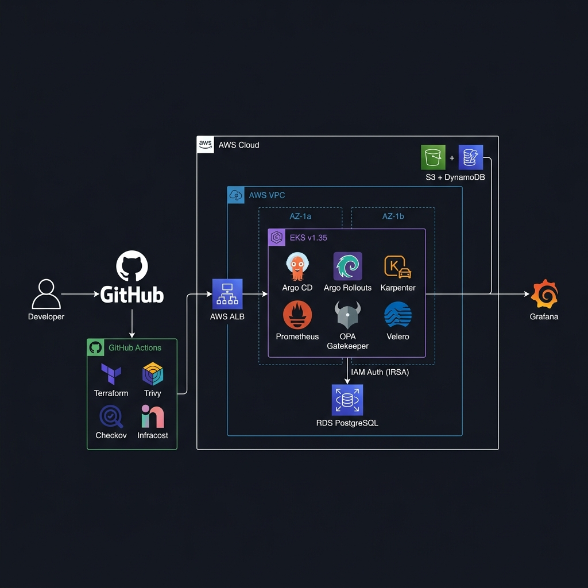

# dev-platform

A production-grade Internal Developer Platform built on AWS, demonstrating infrastructure ownership, GitOps delivery, security hardening, and full-stack observability.

## Architecture




- **AWS VPC** — Multi-AZ network with public/private subnets, NAT Gateway, and least-privilege routing
- **EKS** — Managed Kubernetes cluster (v1.35) with auto-scaling node groups
- **Argo CD & Rollouts** — GitOps continuous & progressive delivery (Canary deployments)
- **Prometheus & SLOs** — Mathematical Error Budget tracking and full observability stack
- **Remote Terraform State** — S3 backend with DynamoDB locking for team collaboration
- **Network Policies** — Default-deny with explicit allow rules per service
- **Trivy & Checkov** — IaC and container security scanning on every push
- **Infracost** — Cloud cost estimation on Pull Requests
- **Karpenter** — Dynamic right-sized Spot/On-Demand node provisioning
- **RDS PostgreSQL** — Passwordless database authentication via IRSA (IAM Roles for Service Accounts)
- **Golden Path** — Automated scaffolding script for new microservices
- **Incident Runbooks** — Enterprise-grade SEV-1/2/3 incident response documentation

## CI/CD Pipeline

| Trigger | Action |
|---|---|
| Pull Request opened | Terraform plan + Infracost cost estimation comment on PR |
| Merge to main | Terraform apply with production approval gate |
| Every push | Trivy & Checkov security scans |

## Stack

| Layer | Tool |
|---|---|
| Infrastructure as Code | Terraform |
| Remote State | S3 + DynamoDB |
| Container Orchestration | Kubernetes (EKS) |
| GitOps / CD | Argo CD + Argo Rollouts |
| Monitoring & SLOs | Prometheus + Grafana |
| Security Scanning | Trivy + Checkov |
| Cost Optimization | Infracost |
| Node Autoscaling | Karpenter (Spot + On-Demand) |
| Database | RDS PostgreSQL (Passwordless IRSA) |
| Developer Tooling | Custom Bash Scaffolding |
| CI/CD | GitHub Actions |
| Cloud Provider | AWS |

## Repository Structure
dev-platform/
├── bin/
│   └── create-service.sh  # Golden Path generator
├── .github/workflows/
│   ├── terraform.yml      # Plan on PR
│   ├── deploy.yml         # Apply on merge with approval
│   └── security.yml       # Trivy scanning
├── terraform/
│   ├── modules/
│   │   ├── vpc/           # VPC, subnets, NAT gateway
│   │   ├── eks/           # EKS cluster, node groups, Karpenter, IRSA
│   │   └── rds/           # PostgreSQL with IAM authentication
│   ├── backend.tf         # S3 remote state
│   ├── main.tf
│   ├── variables.tf
│   └── provider.tf
├── k8s/
│   ├── apps/
│   │   └── sample-app/    # Argo Rollout (Canary) via GitOps
│   ├── infrastructure/
│   │   └── karpenter-nodepool.yaml  # Spot/On-Demand NodePool
│   ├── monitoring/        # Prometheus + Grafana + SLO PrometheusRules
│   └── network-policies/  # Default deny + allow rules
└── docs/
    └── runbook.md         # SEV-1/2/3 Incident Response Protocol

## How to Deploy

### Prerequisites
- AWS CLI configured
- Terraform >= 1.0
- kubectl + Helm >= 3.0

### 1. Provision Infrastructure
```bash
cd terraform
terraform init
terraform apply
```

### 2. Connect kubectl
```bash
aws eks update-kubeconfig --region us-east-1 --name dev-platform-dev
```

### 3. Install Argo CD & Rollouts
```bash
kubectl create namespace argocd
kubectl apply -n argocd -f https://raw.githubusercontent.com/argoproj/argo-cd/stable/manifests/install.yaml

kubectl create namespace argo-rollouts
kubectl apply -n argo-rollouts -f https://github.com/argoproj/argo-rollouts/releases/latest/download/install.yaml
```

### 4. Install Monitoring
```bash
helm install kube-prometheus-stack prometheus-community/kube-prometheus-stack \
  --namespace monitoring --create-namespace \
  -f k8s/monitoring/values.yaml
```

### 5. Install Karpenter
```bash
kubectl create namespace karpenter
helm install karpenter oci://public.ecr.aws/karpenter/karpenter \
  --namespace karpenter \
  --set settings.clusterName=dev-platform-dev
kubectl apply -f k8s/infrastructure/karpenter-nodepool.yaml
```

### 6. Apply Network Policies
```bash
kubectl apply -f k8s/network-policies/
```

### 7. Access Live Observability
```bash
# Grafana dashboard (real-time cluster metrics + SLOs)
kubectl port-forward svc/kube-prometheus-stack-grafana -n monitoring 3000:80
# Open http://localhost:3000 — admin/admin123

# Argo CD GitOps UI
kubectl port-forward svc/argocd-server -n argocd 8080:443
# Open https://localhost:8080
```

## Key Concepts Demonstrated

- Modular Terraform with remote state and state locking
- GitOps with Argo CD — git is the single source of truth
- Full CI/CD with plan, approval gate, and auto-apply
- Zero-trust networking with Kubernetes Network Policies
- Observability with metrics, dashboards, and alerting
- Progressive Delivery with Argo Rollouts (Safe Canary routing)
- Mathematical SLOs & Error Budget alerting via PrometheusRules
- Security scanning and IaC compliance integrated into every PR
- Shift-left cloud cost optimization (FinOps) via Infracost
- Golden Path developer experience via templated service scaffolding
- Multi-AZ high availability architecture
- Least-privilege IAM and IRSA for workload identity
- Karpenter dynamic node provisioning with Spot/On-Demand balancing
- Passwordless RDS database access via IAM STS tokens (IRSA)
- Enterprise-grade incident response via formal SEV-level runbooks
- DORA metrics tracking (Elite performer tier)
